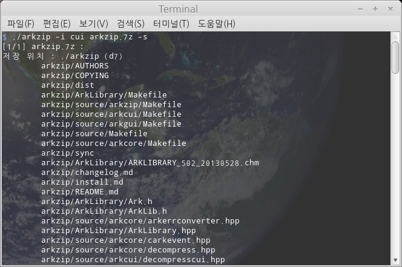
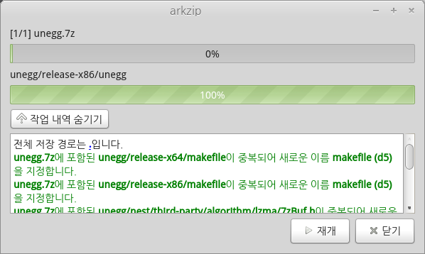
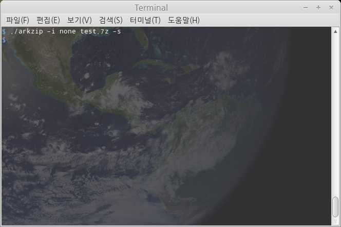
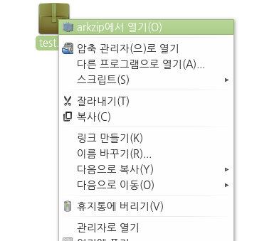
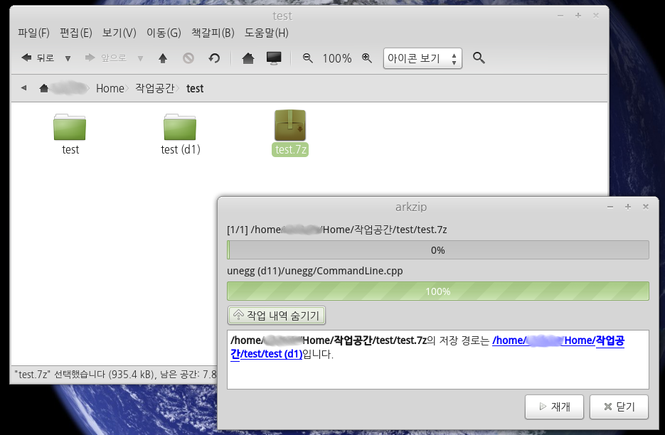

arkzip
=============
**Ark 라이브러리를 사용한 압축 해제 프로그램.**

*특징 :*

* 암호가 걸린 파일을 압축해제 할 수 있습니다.
* alz, egg 압축 포멧을 비롯하여, 다양한 압축 포멧의 파일을 손쉽게 압축 해제 할 수 있습니다.
* 인코딩이 CPC949(EUC-KR)인 경우를 비롯하여 다양한 인코딩으로 인코딩된 압축 파일을 정상적으로 압축해제 할 수 있습니다.

*압축 해제가 가능한 포멧 :* zip, alz, egg, tar, bh, 7z, wim, rar, arj, cab, lzh, gz, bz2, iso, img, xz, z, lzma, j2j.

*사용 환경 :* ubuntu/64bit

*지원 인터페이스 :* 이 프로그램은 gui, cui, 출력 없음 등의 형식으로 사용자에게 작업 수행을 보고할수 있습니다.

+ cui

+ gui 

+ none

*파일 탐색기 연결 :* 파일 탐색기에 확장 아이콘을 연결해두었습니다. 압축 파일을 이 프로그램으로 열면 압축 해제 과정이 시작되게 됩니다.

*사용예 :*

+ test.egg파일을 현재경로에 압축해제 하기.

	ex) `arkzip test.egg -O .`

+ test.alz파일을 gui로 현재경로에 압축해제 하기.

	ex) `arkzip -i gui test.alz`
	
+ test.egg파일을 코드 페이지 kor로 지정하고, 압축 파일명으로된 폴더에 저장위치를 해당 압축 파일이 위치한 경로로 하여 gui로 압축 해제하기.

	ex) `arkzip --link -s -c kor /home/$(whoami)/test/test2/test3/test.egg`

+ test1.zip, test2.zip파일의 암호를 지정하여 test폴더에 압축해제 하기.

	ex) `arkzip test1.zip test2.7z -O test -k password`
    
*수정사항 :* [changelog.md](changelog.md)

*라이센스 :* [LGPL v3](COPYING)

*사용한 프로그램 라이센스 :* [License.txt](License.txt)

*개발자 :* 별님 <w7dn1ng75r@gmail.com>

*설치 방법 :* [install 문서](install.md)를 참조하세요.

*소스 코드 :* <https://github.com/Thestars3/arkzip>
